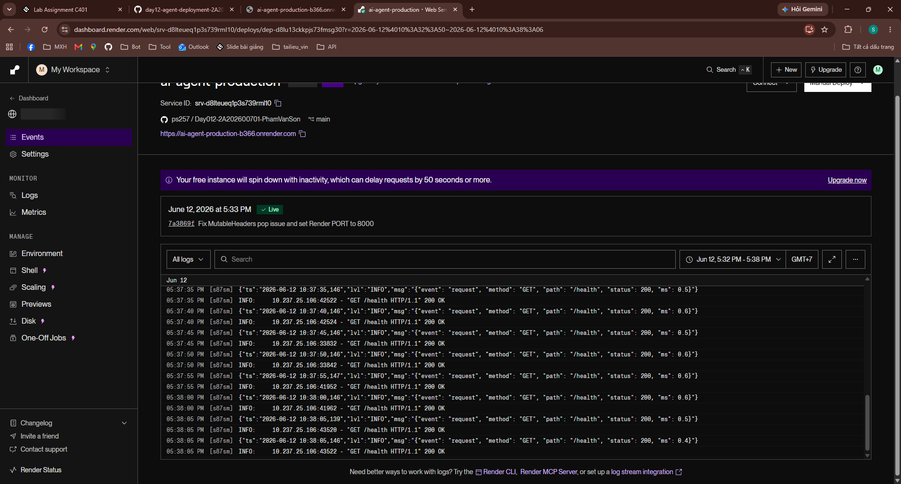
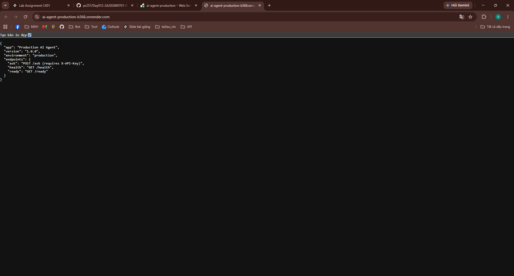
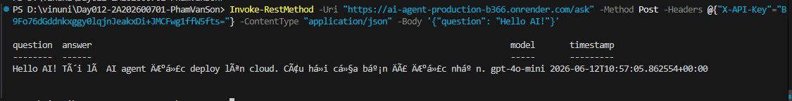

# Deployment Information

## Public URL
https://ai-agent-production-b366.onrender.com

## Platform
Render

## Test Commands

### Health Check
```bash
curl https://ai-agent-production-b366.onrender.com/health
# Expected: {"status": "ok", ...}
```

### API Test (with authentication)
```bash
curl -X POST https://ai-agent-production-b366.onrender.com/ask \
  -H "X-API-Key: vinuni-secret-key-2026" \
  -H "Content-Type: application/json" \
  -d '{"question": "What is AI?"}'
```

### Rate Limiting Test
```bash
for i in {1..25}; do 
  curl -X POST https://ai-agent-production-b366.onrender.com/ask \
    -H "X-API-Key: vinuni-secret-key-2026" \
    -H "Content-Type: application/json" \
    -d '{"question": "Test Rate Limit"}'
done
# Expected: Sau 20 requests đầu tiên, các request sau sẽ trả về 429 Too Many Requests
```

## Environment Variables Set
- `PORT` = 8000
- `ENVIRONMENT` = production
- `AGENT_API_KEY` = vinuni-secret-key-2026
- `REDIS_URL` = [INSERT_REDIS_URL]
- `RATE_LIMIT_PER_MINUTE` = 20
- `DAILY_BUDGET_USD` = 5.0

## Screenshots
- **Deployment Dashboard:**
  
- **Service Running:**
  
- **Test Results:**
  
